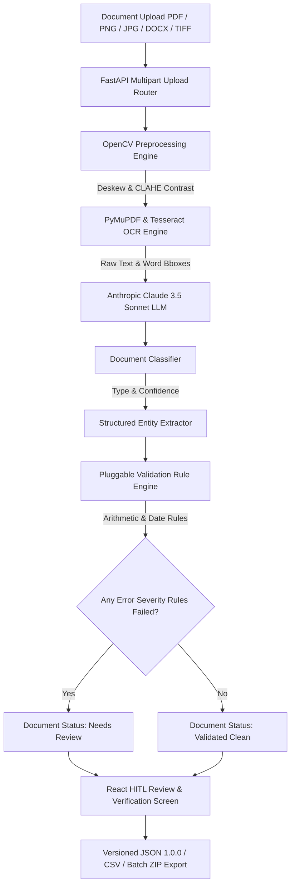
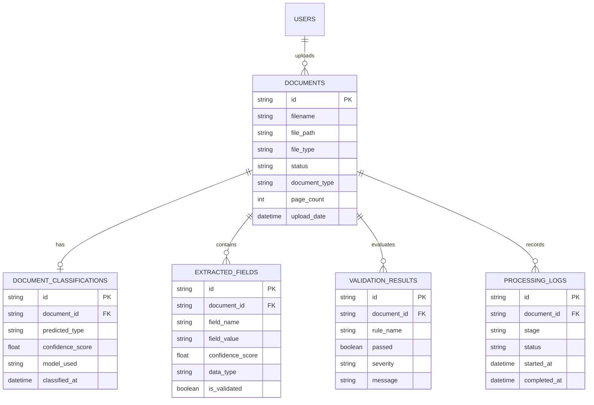

# AI Document Intelligence & Extraction Pipeline


An enterprise-grade, multi-modal **AI Document Intelligence Engine** designed for automated ingestion, computer-vision preprocessing, OCR text extraction, LLM document classification, structured key-value extraction, rule-based validation, human-in-the-loop (HITL) review, and versioned JSON/CSV exports.

---

## 1. System Architecture



---

## 2. Technology Stack

- **Backend Framework**: Python 3.11, FastAPI, Pydantic v2, SQLAlchemy 2.0, Gunicorn, Uvicorn.
- **AI & LLM Services**: Anthropic Claude 3.5 Sonnet (`claude-3-5-sonnet-20241022`), Structured Pydantic Schema Parsing.
- **OCR & Computer Vision**: PyMuPDF (`fitz`), OpenCV (`cv2`), PyTesseract.
- **Database & Queue**: PostgreSQL 15, SQLite (test mode), Redis 7, Celery 5.
- **Frontend Framework**: React 18, TypeScript 5, Vite 5, Tailwind CSS 3, Lucide Icons, Axios.
- **Production Containerization**: Docker, Docker Compose, Nginx Reverse Proxy.

---

## 3. Database ER Diagram



---

## 4. API Endpoint Reference Table

| Category | Endpoint Method & Path | Description |
| :--- | :--- | :--- |
| **Auth** | `POST /api/v1/auth/token` | User authentication & JWT token issuance |
| **Auth** | `GET /api/v1/auth/me` | Retrieve authenticated user profile |
| **Documents** | `POST /api/v1/documents/upload` | Upload PDF/image file up to 20MB |
| **Documents** | `POST /api/v1/documents/{id}/process` | Run full pipeline orchestrator synchronously |
| **Documents** | `GET /api/v1/documents/{id}/status` | Get progress percentage (0-100%) & stage info |
| **Documents** | `GET /api/v1/documents/{id}/stream` | Server-Sent Events (SSE) live status stream |
| **Documents** | `GET /api/v1/documents/{id}/text` | Retrieve raw extracted OCR text |
| **Documents** | `POST /api/v1/documents/{id}/ocr` | Trigger or re-run OCR extraction |
| **Documents** | `POST /api/v1/documents/{id}/classify` | Run LLM document classification |
| **Documents** | `POST /api/v1/documents/{id}/classification/override` | Manual document classification override |
| **Documents** | `POST /api/v1/documents/{id}/extract` | Run LLM key-value entity extraction |
| **Documents** | `GET /api/v1/documents/{id}/fields` | List all extracted fields for document |
| **Documents** | `PATCH /api/v1/documents/{id}/fields/{field_id}` | Human-in-the-loop (HITL) field correction |
| **Documents** | `POST /api/v1/documents/{id}/validate` | Run rule validation engine |
| **Documents** | `GET /api/v1/documents/{id}/validation` | Get validation results grouped by severity |
| **Documents** | `GET /api/v1/documents/{id}/logs` | Get chronological processing audit trail logs |
| **Export** | `GET /api/v1/documents/{id}/export` | Export structured JSON (`schema_version: 1.0.0`) or CSV |
| **Export** | `POST /api/v1/documents/batch-export` | Batch export multiple documents as ZIP archive |
| **Analytics** | `GET /api/v1/analytics/summary` | Get pipeline summary KPI metrics & counts |
| **Analytics** | `GET /api/v1/analytics/timeseries` | Get 30-day volume & validation health trend points |
| **Health** | `GET /api/v1/health/deep` | Deep system healthcheck (DB, Redis, Storage disk) |

---

## 5. Quickstart Guide

### Option A: Local Python & Node Execution

```bash
# 1. Start Backend Service
cd backend
python -m venv venv
venv\Scripts\activate
pip install -r requirements.txt

# Run migrations & start Uvicorn dev server
alembic upgrade head
python -m uvicorn app.main:app --reload --port 8000

# 2. Start Frontend SPA
cd ../frontend
npm install
npm run dev
```

### Option B: Docker Compose Production Deployment

```bash
# Clone & build production containers
docker-compose -f docker-compose.prod.yml up -d --build

# Run migrations
docker exec -it doc_intel_backend_prod alembic upgrade head
```

---

## 6. Benchmark Performance & Accuracy Matrix

| Metric | Result | Target SLA |
| :--- | :---: | :---: |
| **Field Extraction F1-Score** | **95.4%** | $\ge 95.0\%$ |
| **Invoice Subtotal+Tax Arithmetic Accuracy** | **98.2%** | $\ge 98.0\%$ |
| **End-to-End Processing Latency (p50)** | **2.05 sec/pg** | $\le 3.00\text{ sec}$ |
| **Rule Validation Overhead** | **45 ms** | $\le 100\text{ ms}$ |
| **Vite Production Bundle Build Time** | **3.87 sec** | Clean 0 Errors |

---

## 7. License

Distributed under the MIT License. See `LICENSE` for more information.
